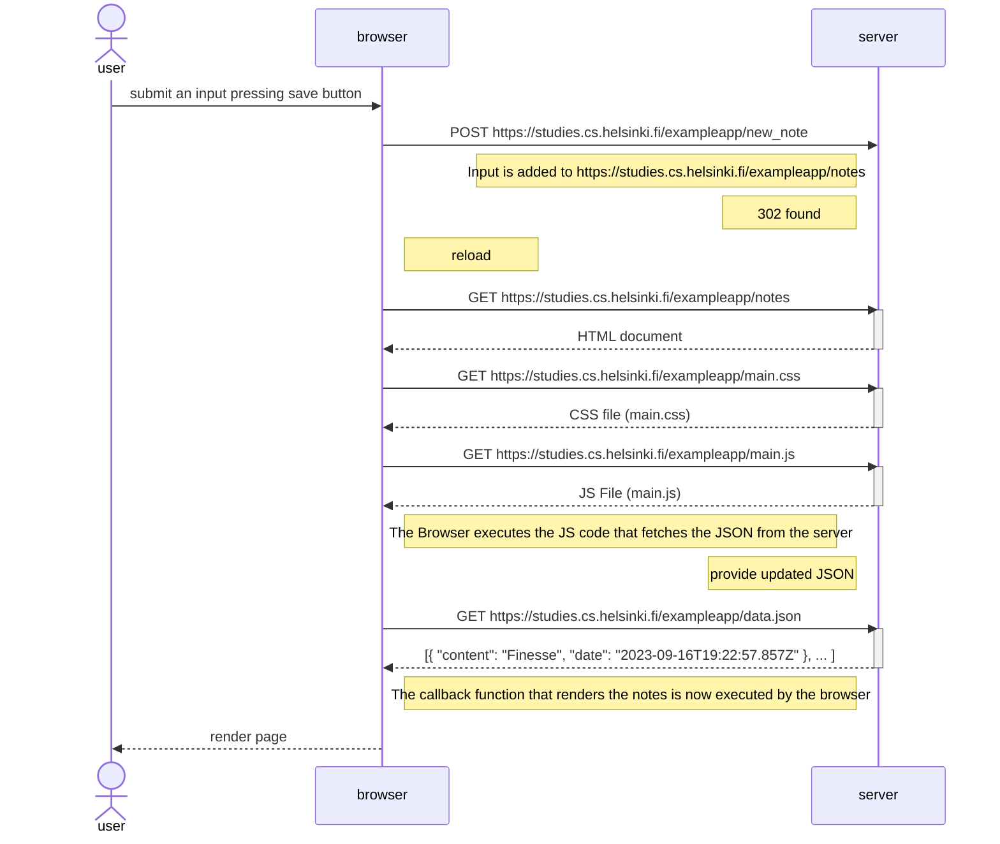

```mermaid
sequenceDiagram
	actor user

	participant user
	participant browser
	participant server

	user->>browser: submit an input pressing save button
	browser->>server: POST https://studies.cs.helsinki.fi/exampleapp/new_note

Note left of server: Input is added to https://studies.cs.helsinki.fi/exampleapp/notes
Note left of server: 302 found
Note right of browser: reload

	browser->>server: GET https://studies.cs.helsinki.fi/exampleapp/notes
	activate server
	server-->>browser: HTML document
	deactivate server

	browser->>server: GET https://studies.cs.helsinki.fi/exampleapp/main.css
	activate server
	server-->>browser: CSS file (main.css)
	deactivate server

	browser->>server: GET https://studies.cs.helsinki.fi/exampleapp/main.js
	activate server
	server-->>browser: JS File (main.js)
	deactivate server
	
Note right of browser: The Browser executes the JS code that fetches the JSON from the server
Note left of server: provide updated JSON

	browser->>server: GET https://studies.cs.helsinki.fi/exampleapp/data.json
	activate server
	server-->>browser: [{ "content": "Finesse", "date": "2023-09-16T19:22:57.857Z" }, ... ]
    deactivate server
    
Note right of browser: The callback function that renders the notes is now executed by the browser

	browser-->>user: render page 	
```
