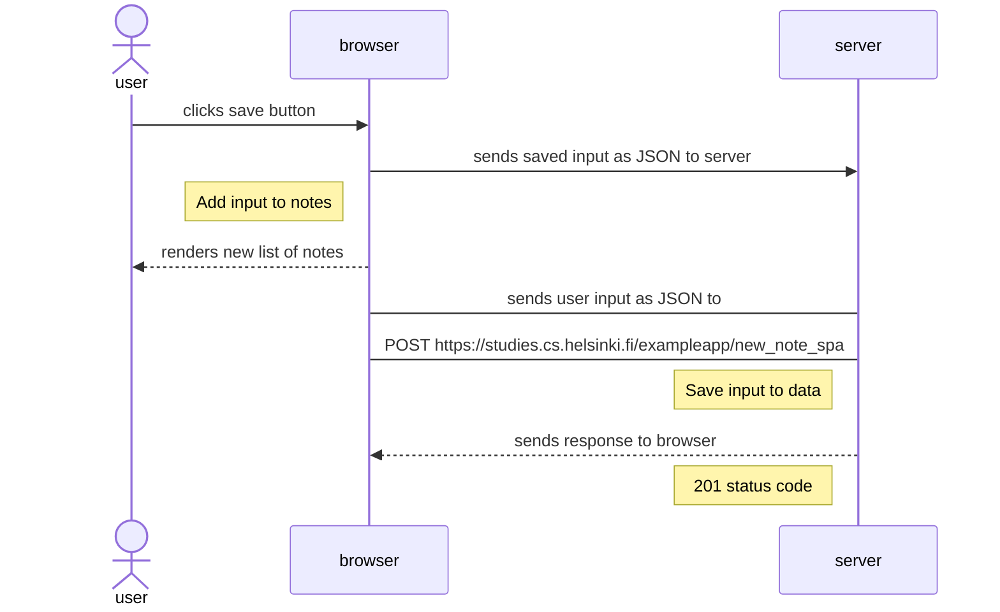

```mermaid

sequenceDiagram
  actor user

  participant user
  participant browser
  participant server

  user->>browser: clicks save button
	browser->>server: sends saved input as JSON to server
  

Note left of browser: Add input to notes

  browser-->>user: renders new list of notes
  browser->server: sends user input as JSON to 
  browser->server: POST https://studies.cs.helsinki.fi/exampleapp/new_note_spa

Note left of server: Save input to data

  server-->>browser: sends response to browser

Note left of server: 201 status code

```
