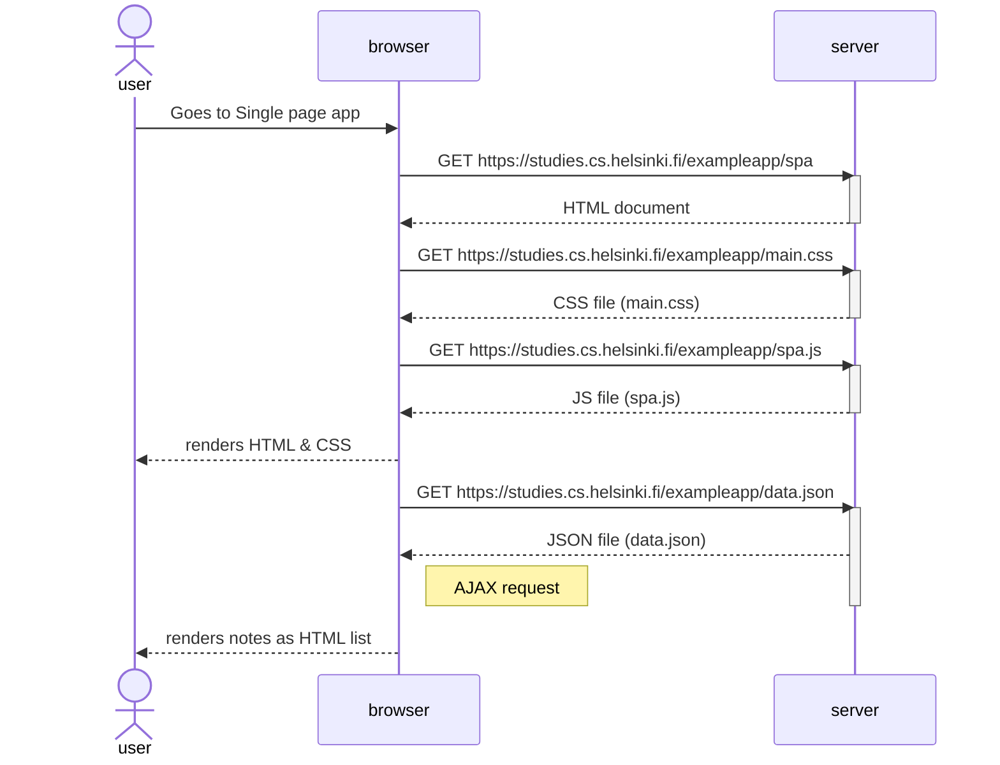

```mermaid

sequenceDiagram
	actor user

	participant user
	participant browser
	participant server

user->>browser: Goes to Single page app
browser->>server: GET https://studies.cs.helsinki.fi/exampleapp/spa
activate server
server-->>browser: HTML document
deactivate server

browser->>server: GET https://studies.cs.helsinki.fi/exampleapp/main.css
activate server
server-->>browser: CSS file (main.css)
deactivate server

browser->>server: GET https://studies.cs.helsinki.fi/exampleapp/spa.js
activate server
server-->>browser: JS file (spa.js)
deactivate server

browser-->>user: renders HTML & CSS
browser->>server: GET https://studies.cs.helsinki.fi/exampleapp/data.json
activate server
server-->>browser: JSON file (data.json)
note right of browser: AJAX request
deactivate server
browser-->>user: renders notes as HTML list

```
